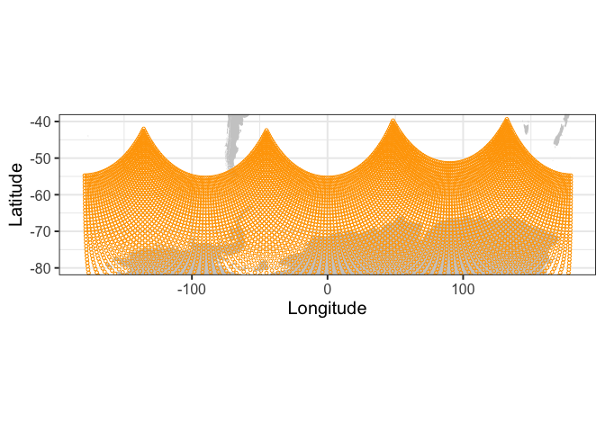

# Convert Polar Stereographic Coordinates to Lat-Lon

> Notebook Filename: reproject\_epsg3412\_to\_4326.Rmd  
> Authors: RG. Cutter, D. Kinzey, J. Sevadjian

When working in the polar regions, we often need to integrate data that
are in different projections. This example demonstrates how to use R to
convert the projected coordinates of the NSIDC Sea Ice Concentration
product to latitude-longitude coordinates.

This R code demonstrates the following techniques:

  - Accessing a dataset with polar stereographic coordinates from the
    PolarWatch ERDDAP server  
  - Converting projected coordinates to latitude-longitude coordinates
    (WGS84, EPSG:4326).

## Install required packages and load libraries

The required packages are **maptools**, **rgdal**, **sp**, **mapdata**,
and **ggplot2**.

``` r
# Function to check if pkgs are installed, install missing pkgs, and load
pkgTest <- function(x)
{
  if (!require(x,character.only = TRUE))
  {
    install.packages(x,dep=TRUE,repos='http://cran.us.r-project.org')
    if(!require(x,character.only = TRUE)) stop(x, " :Package not found")
  }
}

list.of.packages <- c("maptools","rgdal","sp", "mapdata", "ggplot2")

# create list of installed packages
pkges = installed.packages()[,"Package"]
for (pk in list.of.packages) {
  pkgTest(pk)
}
```

## Create a list of polar projected coordinates to transform

This example takes a list of polar projected coordinates and transforms
them to lat-lon coordinates. We will use a projected dataset from the
PolarWatch ERDDDAP to generate a polar coordinate list.

  - Download projected coordinates from the NSIDC NOAA Sea Ice
    Concentration CDR
  - This is a gridded dataset that covers the area around Antarctica
  - The request url was generated using the dataset data access form
    online at:
    <https://polarwatch.noaa.gov/erddap/griddap/nsidcG02202v4sh1day.html>
  - Here we demonstrate working with a csv output of the polar
    coordinates.

<!-- end list -->

``` r
coordinate_filename = 'projected_coord_input.csv'

url <- 'https://polarwatch.noaa.gov/erddap/griddap/nsidcG02202v4sh1day.csv0?ygrid%5B(4337500.0):4:(-3937500.0)%5D,xgrid%5B(-3937500.0):4:(3937500.0)%5D'

download.file(url, destfile=coordinate_filename)
```

## Read in the polar coordinates from the .csv file

  - Read in the .csv file from our working directory
  - Note that the csv output provides the coordinates as arrays (not a
    grid)
  - Generate coordinate pairs from the lists using **expand**.
  - Create a dataframe of coordinate points

<!-- end list -->

``` r
indata = read.csv(coordinate_filename, header=FALSE)

# Create ygrid and xgrid vectors from the data frame columns and remove any padded NaNs
ygrid <- indata$V1[!is.nan(indata$V1)]
xgrid <- indata$V2[!is.nan(indata$V2)]

# Use expand to create a points data frame of all possible coordinate combinations
points.df <- expand.grid(ygrid,xgrid)

head(points.df)
```

    ##      Var1     Var2
    ## 1 4337500 -3937500
    ## 2 4237500 -3937500
    ## 3 4137500 -3937500
    ## 4 4037500 -3937500
    ## 5 3937500 -3937500
    ## 6 3837500 -3937500

## Create a spatial dataframe of the coordinates

Next we will convert the coordinate points dataframe to a spatial object
(spatial dataframe). Create the **coordsinit** variable to verify the
initial coordinates of the spatial dataframe.

``` r
dfcoords = cbind(points.df$Var1, points.df$Var2)      # coords in y,x order
sppoints = SpatialPoints(coords = dfcoords)
spdf     = SpatialPointsDataFrame(coords = dfcoords, points.df)

coordsinit <- spdf@coords
```

## Reproject data from polar sterographic to latitude-longitude

  - Define each of the coordinate reference systems
  - The polar stereographic projection is EPSG:3412
  - The latitude-longitude (WGS84) projection is EPSG:4326
  - Transform the coordinates with **spTransform**
  - Check new coordinates with **coords** and **bbox**

<!-- end list -->

``` r
# Define coordinate reference systems
crslatlong       = CRSargs(CRS("+init=epsg:4326"))
crsseaicepolster3412 = CRSargs(CRS("+init=epsg:3412"))

# Set CRS of spatial dataframe
proj4string(spdf) = CRS(crsseaicepolster3412)
ps_bbox       = spdf@bbox
print(ps_bbox)
```

    ##                min     max
    ## coords.x1 -3862500 4337500
    ## coords.x2 -3937500 3862500

``` r
# Check the initial CRS 
crs_set = proj4string(spdf)

# Converts from existing crs to latlon (4326)
spdfProjected = spTransform(spdf, CRS(crslatlong))  
crs_projected = proj4string(spdfProjected)

coordsproj = spdfProjected@coords
bbox       = spdfProjected@bbox
print( bbox )
```

    ##                  min       max
    ## coords.x1 -179.09062 179.45434
    ## coords.x2  -89.51045 -39.36487

## Make a map with the new coordinates

  - Map the latitude-longitude coordinate locations with ggplot

<!-- end list -->

``` r
df_latlon <- as.data.frame(spdfProjected)
longitude = df_latlon$coords.x1
xlim <- c(-180,180)
ylim <- c(-80,-40)
coast <- map_data("worldHires", ylim = ylim, xlim = xlim)

myplot<-ggplot(data=df_latlon, aes(x=coords.x1,y=coords.x2)) +
  geom_polygon(data = coast, aes(x=long, y = lat, group = group), fill = "grey80") +
  theme_bw(base_size = 15) + ylab("Latitude") + xlab("Longitude") +
  coord_fixed(2.7,xlim = xlim, ylim = ylim) +
  geom_point(data=df_latlon, aes(x=coords.x1,y=coords.x2),inherit.aes = FALSE, size=1,shape=21,color="orange")

myplot
```

<!-- -->

> History:  
> \* Mar 2022: Updated to latest version of CDR dataset, added .md
> output, J. Sevadjian \* Nov 2020: Converted to Rmd notebook, added
> ERRDAP coordinate retrieval, J. Sevadjian.  
> \* Feb 2020: Created code snippet, simplified from: AMLR\_GIS\_in\_R
> by RG. Cutter and D. Kinzey. Nov 2017: AMLR\_GIS\_in\_R.R, G Cutter.
