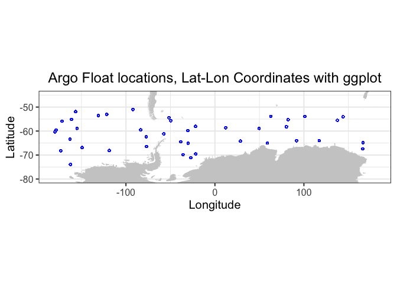
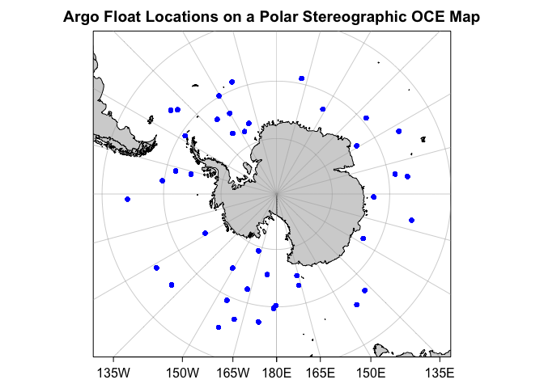
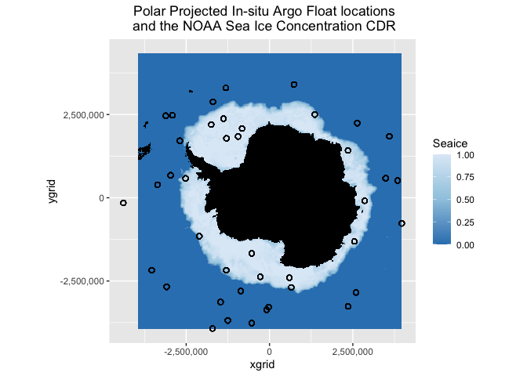

# Converting Latitude-Longitude Coordinates to Polar Stereographic

> Notebook Filename: reproject\_epsg4326\_to\_3412.Rmd  
> Authors: RG. Cutter, D. Kinzey, J. Sevadjian

When working in the polar regions, we often need to integrate data that
are in different projections. This example demonstrates how to use R to
convert latitude-longitude coordinates to polar stereographic
coordinates in order to integrate in-situ Argo float data with satellite
sea ice concentration data.

This R code demonstrates the following techniques:

  - Accessing an in-situ dataset with lat-lon coordinates from the
    PolarWatch ERDDAP server  
  - Converting data with latitude-longitude coordinates (WGS84,
    EPSG:4326) to projected coordinates (EPSG:3412).  
  - Creating a maps of in-situ and projected satellite data together

## Install required packages and load libraries

The required packages are **maptools**, **rgdal**, **sp**, **oce**,
**ocedata**, **mapdata**, **ggplot2**, **RColorBrewer**, **ggspatial**,
**ncdf4**, **lubridate**, and **scales**. The **mapdata** package is
used for a coastline/basemap in ggplot.

``` r
# Function to check if pkgs are installed, install missing pkgs, and load
pkgTest <- function(x)
{
  if (!require(x,character.only = TRUE))
  {
    install.packages(x,dep=TRUE,repos='http://cran.us.r-project.org')
    if(!require(x,character.only = TRUE)) stop(x, " :Package not found")
  }
}

list.of.packages <- c("maptools","rgdal","sp", "oce","ocedata", "mapdata", "ggplot2", "RColorBrewer", "ggspatial", "ncdf4", "lubridate","scales")

# create list of installed packages
pkges = installed.packages()[,"Package"]
for (pk in list.of.packages) {
  pkgTest(pk)
}
```

## Download in-situ data with lat/lon coordinates

We will use the SOCCOM BGC Argo float in-situ dataset on the PolarWatch
ERDDAP server. This dataset has latitude-longitude coordinates (WGS84).

  - Request and download the dataset coordinate variables from ERDDAP
  - This ERDDAP data request url was generated using the dataset data
    access form online at
    <https://polarwatch.noaa.gov/erddap/tabledap/SOCCOM_BGC_Argo_Snapshot_Archive.html>
  - There are many additional file format options with ERDDAP, here we
    demonstrate working with csv output

<!-- end list -->

``` r
argo_url <- 'https://polarwatch.noaa.gov/erddap/tabledap/SOCCOM_BGC_Argo_Snapshot_Archive.csv0?latitude%2Clongitude&time%3E=2020-08-23T00%3A00%3A00Z&time%3C=2020-08-30T02%3A34%3A00Z&latitude%3C=-50'

download.file(argo_url, destfile='lat_lon_coordinates_input.csv')
```

## Read in the Argo float coordinates from the .csv file

  - Read in the float coordinates .csv file from our working directory
  - Create a dataframe of lat-lon coordinate points
  - The coordinates are the locations of individual Argo float profiles

<!-- end list -->

``` r
infn = "lat_lon_coordinates_input.csv"

indata = read.csv( infn, header=FALSE)
```

## Create Spatial Dataframe

Convert the Argo float coordinate points dataframe to a spatial object
(spatial dataframe)

``` r
latitude <- indata$V1
longitude <- indata$V2

# Longitude for this dataset goes from 0-360 but the transform library uses -180/180
# Convert from 360 to -180/180
lon180 <- ((longitude + 180) %% 360) - 180
indata$V2 <- lon180

dfcoords = cbind(lon180,latitude)      # coords in lon, lat order
sppoints = SpatialPoints(coords = indata)
spdf     = SpatialPointsDataFrame(coords = dfcoords, indata)

# Verify initial coordinates of spatial dataframe
coordsinit <- spdf@coords

# Define coordinate reference systems
crslonglat       = CRSargs(CRS("+init=epsg:4326")) # order is longitude latitude in R CRS
crsseaicepolster3412 = CRSargs(CRS("+init=epsg:3412"))
```

## Map the Argo Float Locations with ggplot

To get a sense for the Argo float locations in latitude-longitude, we
will create a ggplot map using the lat-lon float coordinates.

  - This map uses latitude-longitude for the axes

<!-- end list -->

``` r
xlim <- c(-180,180)
ylim <- c(-80,-45)
coast <- map_data("worldHires", ylim = ylim, xlim = xlim)
main="Argo Float locations, Lat-Lon Coordinates with ggplot"  
myplot<-ggplot(data = indata, aes(x = V2, y = V1)) +
  geom_polygon(data = coast, aes(x=long, y = lat, group = group), fill = "grey80") +
  theme_bw(base_size = 15) + ylab("Latitude") + xlab("Longitude") +
  coord_fixed(2.7,xlim = xlim, ylim = ylim) +
  geom_point(data=indata, aes(x=V2, y=V1), size=1, shape=21, color="blue") +
  ggtitle(main)+
  theme(plot.title = element_text(hjust = 0.5))
  
myplot
```

<!-- -->

## Map the Argo Float Locations on a Polar Stereographic Map

Next, let’s plot the same float location data again, with a polar
stereographic view using the OCE package.

  - This plotting package allows us to specify the projection of the map
    while still using lat-lon coordinates for the float locations.

<!-- end list -->

``` r
# define map extents
ylim <- c(-79,-50)
xlim <- c(-170,70)
data("coastlineWorldMedium") # included in ocedata

# set plot margins (bottom, left, top, right)
par(mar=c(2, 6, 2, 6))

# make a base
mapPlot(coastlineWorldMedium, 
        projection=crsseaicepolster3412,
        col="lightgray", 
        longitudelim=xlim, 
        latitudelim=ylim,
        main="Argo Float Locations on a Polar Stereographic OCE Map"
        )

## add float location points
mapPoints(lon180, latitude, col = "blue", pch = 20)
```

<!-- -->

## Transform the Argo float coordinates from latitude-longitude to polar stereographic

We ultimately want to analyze the Argo float data in conjunction with a
sea ice dataset that is in polar stereographic coordinates. So, next we
will demonstrate converting the coordinates of the Argo float data into
the projected coordinates of a satellite sea ice data set.

  - Define each of the coordinate reference systems
  - The satellite sea ice dataset is the NOAA Sea Ice Concentration CDR
    which is in the NSIDC Polar Stereographic South projection. The code
    for this projection is EPSG:3412.
  - The Latitude-Longitude projection of the Argo float dataset is known
    as WGS84 with a code of EPSG:4326.
  - Transform the lat-lon coordinates to polar stereographic with
    `spTransform`
  - Check new coordinates with `coords` and `bbox`

<!-- end list -->

``` r
# Set initial CRS of spatial dataframe
proj4string(spdf) = CRS(crslonglat)
lat_lon_bbox       = spdf@bbox
print(lat_lon_bbox)
```

    ##               min     max
    ## lon180   -179.641 166.398
    ## latitude  -73.909 -51.006

``` r
# Check the CRS 
crs_set = proj4string(spdf)

# Converts from existing lat-lon crs to polar stereo (3412)
spdfProjected = spTransform(spdf, CRS(crsseaicepolster3412))  
crs_projected = proj4string(spdfProjected)

coordsproj = spdfProjected@coords
bbox       = spdfProjected@bbox
print( bbox )
```

    ##               min     max
    ## lon180   -4385774 3967157
    ## latitude -3924592 3401168

## Get polar projected sea ice satellite data from ERDDAP

Here we use a preconfigured ERDDAP data request url to access the NOAA
Sea Ice Concentration CDR dataset from ERDDAP. For more information
about accessing this dataset from ERDDAP, including step-by-step
examples of subsetting the dataset and moving between projected and
lat-lon coordinates, see the “Accessing Projected Datasets” R tutorial
in our course materials.
<https://github.com/CoastWatch-WestCoast/r_code/blob/master/accessing_projected_datasets.md>

``` r
sea_ice_url <- 'https://polarwatch.noaa.gov/erddap/griddap/nsidcG02202v4sh1day.nc?cdr_seaice_conc%5B(2021-05-31T00:00:00Z):1:(2021-05-31T00:00:00Z)%5D%5B(4337500.0):1:(-3937500.0)%5D%5B(-3937500.0):1:(3937500.0)%5D'

# Download the sea ice data NetCDF file  (a single timestamp)
sea_ice_data_nc <- download.file(sea_ice_url, destfile="sea_ice_data.nc", mode='wb')
sea_ice_dataFid <- nc_open('sea_ice_data.nc')

ygrid <- ncvar_get(sea_ice_dataFid, varid="ygrid")
xgrid <- ncvar_get(sea_ice_dataFid, varid="xgrid")
seaiceCDR <- ncvar_get(sea_ice_dataFid, varid='cdr_seaice_conc')

nc_close(sea_ice_dataFid)
```

## Plot the projected in-situ data with the NSIDC Sea Ice CDR

  - Plot the projected Argo float point data on top of the NOAA sea ice
    concentration CDR data using ggplot
  - This map has projected coordinates as the axes
  - Visually check the locations of the transformed coordinates

<!-- end list -->

``` r
icemap2 <- expand.grid(xgrid=xgrid, ygrid=ygrid)

icemap2$Seaice <- array(seaiceCDR[,], dim(xgrid)*dim(ygrid))
icemap2$Seaice[icemap2$Seaice > 2] <- NA 

df_projected <- as.data.frame(spdfProjected)

main=" Polar Projected In-situ Argo Float locations\n aligned with the NOAA Sea Ice Concentration CDR Grid"  
myplot <- ggplot(data = icemap2, aes(x = xgrid, y = ygrid, fill=Seaice) ) + 
       geom_tile() + 
       coord_fixed(ratio = 1) + 
       scale_y_continuous(labels = comma) + 
       scale_x_continuous(labels = comma) +
       scale_fill_gradientn(colours=rev(brewer.pal(n = 1, name = "Blues")),na.value="black") +
       geom_point(data=df_projected, aes(x=lon180, y=latitude),inherit.aes = FALSE, size=2,shape=21,color="black") +
       labs(title=main)+
    theme(plot.title = element_text(hjust = 0.5))

myplot
```

<!-- -->

> History:  
> Mar 2022: Updated satellite dataset to latest version of CDR.
> Simplified by removing subsetting projected data portion.  
> Nov 2020: Converted to Rmd notebook, added ERRDAP lat-lon coordinate
> retrieval, J. Sevadjian.  
> Feb 2020: Created code snippet, simplified from: AMLR\_GIS\_in\_R by
> RG. Cutter and D. Kinzey. Nov 2017: AMLR\_GIS\_in\_R.R, G Cutter.
